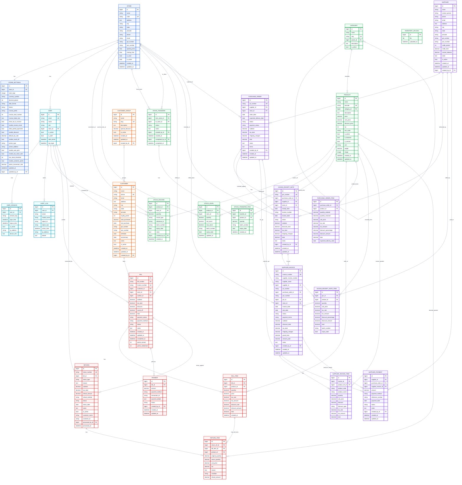

# POS Backend ERD

```mermaid
%%{init: {'theme': 'base', 'themeVariables': {'background': '#ffffff', 'primaryColor': '#EEF4FF', 'primaryBorderColor': '#2563EB', 'primaryTextColor': '#0F172A', 'lineColor': '#475569', 'fontFamily': 'Arial'}}}%%
erDiagram
  STORE {
    bigint id PK
    string name
    string code UK
    text address
    string city
    string state
    string pincode
    string phone
    string email
    string gst_number
    string pan_number
    time opening_time
    time closing_time
    bool is_main
    bool is_active
    datetime created_at
    datetime updated_at
  }

  STORE_SETTINGS {
    bigint id PK
    bigint store_id FK
    image store_logo
    string currency_symbol
    int decimal_places
    string date_format
    string theme
    string invoice_prefix
    int invoice_start_number
    text invoice_footer_text
    bool show_tax_in_invoice
    bool enable_invoice_email
    bool allow_partial_payments
    bool enable_discount
    decimal default_tax_rate
    bool enable_round_off
    string printer_type
    string printer_address
    bool enable_auto_print
    bool enable_low_stock_alert
    int low_stock_threshold
    bool enable_customer_points
    decimal points_conversion_rate
    datetime updated_at
    bigint updated_by_id FK
  }

  USER {
    bigint id PK
    string email UK
    string name
    string role
    bigint store_id FK
    bool is_active
    bool is_staff
    datetime date_joined
    datetime last_login
  }

  USER_SESSION {
    bigint id PK
    bigint user_id FK
    string session_key
    datetime login_time
    datetime logout_time
    bool is_active
    string ip_address
    text device_info
  }

  AUDIT_LOG {
    bigint id PK
    bigint user_id FK
    string action
    string model_name
    string object_id
    string object_repr
    datetime action_time
    string ip_address
    json details
  }

  CATEGORY {
    bigint id PK
    string name
    string slug UK
    bigint parent_id FK
    text description
    bool is_active
  }

  PRODUCT {
    bigint id PK
    string name
    string barcode UK
    bigint category_id FK
    text description
    decimal price
    decimal cost_price
    decimal discount_price
    int tax
    string hsn_code
    bool is_active
    bool is_featured
    bool is_service
    string unit
    decimal weight
    image image
    datetime created_at
    datetime updated_at
  }

  STOCK_RECORD {
    bigint id PK
    bigint product_id FK
    bigint store_id FK
    decimal quantity
    string record_type
    string reference_id
    string batch_number
    date expiry_date
    text notes
    bigint created_by_id FK
    datetime created_at
  }

  STOCK_LEVEL {
    bigint id PK
    bigint product_id FK
    bigint store_id FK
    decimal quantity
    decimal min_stock
    decimal max_stock
    string batch_number
    date expiry_date
    datetime updated_at
  }

  STOCK_TRANSFER {
    bigint id PK
    bigint from_store_id FK
    bigint to_store_id FK
    string status
    text notes
    bigint created_by_id FK
    datetime created_at
    bigint completed_by_id FK
    datetime completed_at
  }

  STOCK_TRANSFER_ITEM {
    bigint id PK
    bigint transfer_id FK
    bigint product_id FK
    decimal quantity
    string batch_number
    date expiry_date
    datetime created_at
  }

  INVENTORY_UPLOAD {
    bigint id PK
    file file
    datetime uploaded_at
  }

  CUSTOMER {
    bigint id PK
    string name
    string phone UK
    string email
    text address
    string city
    string state
    string pincode
    int loyalty_points
    decimal total_purchases
    date last_purchase
    string gst_number
    string pan_number
    date birthdate
    date anniversary
    text notes
    bool is_active
    datetime created_at
    datetime updated_at
    bigint created_by_id FK
  }

  CUSTOMER_GROUP {
    bigint id PK
    string name
    string slug UK
    text description
    decimal special_discount
    bool is_active
    datetime created_at
    datetime updated_at
    bigint created_by_id FK
  }

  BILL {
    bigint id PK
    string bill_number UK
    string invoice_number UK
    bigint customer_id FK
    bigint store_id FK
    bigint cashier_id FK
    decimal subtotal
    decimal tax_total
    decimal discount
    decimal round_off
    decimal total
    string payment_status
    string payment_method
    string status
    text notes
    datetime created_at
    datetime updated_at
    datetime completed_at
    int points_earned
    int points_redeemed
  }

  BILL_ITEM {
    bigint id PK
    bigint bill_id FK
    bigint product_id FK
    decimal quantity
    decimal price
    decimal tax_rate
    decimal tax_amount
    decimal discount_rate
    decimal discount_amount
    decimal total
    datetime created_at
  }

  PAYMENT {
    bigint id PK
    bigint bill_id FK
    decimal amount
    string payment_method
    string transaction_id
    json payment_details
    string status
    bigint created_by_id FK
    datetime created_at
    datetime updated_at
  }

  SUPPLIER {
    bigint id PK
    string name
    string contact_person
    string phone
    string email
    text address
    string city
    string state
    string pincode
    string gst_number
    string pan_number
    int credit_period
    decimal credit_limit
    decimal current_balance
    text notes
    bool is_active
    datetime created_at
    datetime updated_at
    bigint created_by_id FK
  }

  PURCHASE_ORDER {
    bigint id PK
    string po_number UK
    bigint supplier_id FK
    bigint store_id FK
    date order_date
    date expected_delivery_date
    string status
    string payment_status
    decimal subtotal
    decimal tax_total
    decimal shipping_charges
    decimal total
    text notes
    text terms
    bigint created_by_id FK
    datetime created_at
    datetime updated_at
  }

  PURCHASE_ORDER_ITEM {
    bigint id PK
    bigint purchase_order_id FK
    bigint product_id FK
    decimal quantity_ordered
    decimal quantity_received
    decimal unit_price
    decimal tax_rate
    decimal tax_amount
    decimal discount_percentage
    decimal discount_amount
    decimal total
    date expected_delivery_date
  }

  GOODS_RECEIPT_NOTE {
    bigint id PK
    string grn_number UK
    bigint purchase_order_id FK
    bigint supplier_id FK
    bigint store_id FK
    date receipt_date
    string invoice_number
    date invoice_date
    string status
    decimal subtotal
    decimal discount_total
    decimal tax_total
    decimal shipping_charges
    decimal total
    text notes
    bigint created_by_id FK
    datetime created_at
    datetime updated_at
  }

  GOODS_RECEIPT_NOTE_ITEM {
    bigint id PK
    bigint grn_id FK
    bigint product_id FK
    decimal quantity
    decimal unit_price
    decimal tax_rate
    decimal tax_amount
    decimal discount_percentage
    decimal discount_amount
    decimal total
    string batch_number
    date expiry_date
  }

  SUPPLIER_INVOICE {
    bigint id PK
    string invoice_number UK
    string supplier_invoice_number
    string supplier_name
    bigint supplier_id FK
    string po_number
    bigint purchase_order_id FK
    string grn_number
    bigint grn_id FK
    bigint store_id FK
    date invoice_date
    date due_date
    string status
    string payment_terms
    decimal subtotal
    decimal discount_total
    decimal tax_total
    decimal shipping_charges
    decimal grand_total
    decimal amount_paid
    text notes
    bigint created_by_id FK
    datetime created_at
    datetime updated_at
  }

  SUPPLIER_INVOICE_ITEM {
    bigint id PK
    bigint invoice_id FK
    bigint product_ref_id FK
    string product_code
    string product_name
    decimal quantity
    decimal unit_price
    decimal discount
    string discount_type
    decimal tax_rate
    decimal tax_amount
    decimal total
  }

  SUPPLIER_PAYMENT {
    bigint id PK
    bigint supplier_id FK
    bigint purchase_order_id FK
    bigint supplier_invoice_id FK
    decimal amount
    string payment_method
    string reference_number
    date payment_date
    string status
    text notes
    bigint created_by_id FK
    datetime created_at
    datetime updated_at
  }

  RETURN {
    bigint id PK
    string return_number UK
    bigint bill_id FK
    string return_type
    text reason
    decimal subtotal
    decimal tax_total
    decimal refund_amount
    string refund_method
    string status
    date return_date
    text notes
    bool is_active
    string customer_name
    string customer_id
    bigint processed_by_id FK
    datetime processed_at
  }

  RETURN_ITEM {
    bigint id PK
    bigint return_ref_id FK
    bigint bill_item_id FK
    bigint product_id FK
    decimal original_quantity
    decimal return_quantity
    decimal unit_price
    decimal tax
    text reason
    string condition
    decimal refund_amount
  }

  STORE ||--|| STORE_SETTINGS : has
  STORE ||--o{ USER : has
  USER ||--o{ USER_SESSION : has
  USER ||--o{ AUDIT_LOG : writes

  CATEGORY ||--o{ CATEGORY : parent_of
  CATEGORY ||--o{ PRODUCT : classifies
  PRODUCT ||--o{ STOCK_RECORD : movement
  STORE ||--o{ STOCK_RECORD : movement_at
  USER ||--o{ STOCK_RECORD : recorded_by
  PRODUCT ||--o{ STOCK_LEVEL : current_stock
  STORE ||--o{ STOCK_LEVEL : current_stock_at

  STORE ||--o{ STOCK_TRANSFER : from_store
  STORE ||--o{ STOCK_TRANSFER : to_store
  STOCK_TRANSFER ||--o{ STOCK_TRANSFER_ITEM : has
  PRODUCT ||--o{ STOCK_TRANSFER_ITEM : moved_item

  USER ||--o{ CUSTOMER : created
  CUSTOMER_GROUP }o--o{ CUSTOMER : groups

  CUSTOMER ||--o{ BILL : buys
  STORE ||--o{ BILL : billed_at
  USER ||--o{ BILL : cashier
  BILL ||--o{ BILL_ITEM : has
  PRODUCT ||--o{ BILL_ITEM : sold_as
  BILL ||--o{ PAYMENT : paid_by

  SUPPLIER ||--o{ PURCHASE_ORDER : supplies
  STORE ||--o{ PURCHASE_ORDER : ordered_for
  PURCHASE_ORDER ||--o{ PURCHASE_ORDER_ITEM : has
  PRODUCT ||--o{ PURCHASE_ORDER_ITEM : ordered_item

  PURCHASE_ORDER ||--o{ GOODS_RECEIPT_NOTE : received_against
  SUPPLIER ||--o{ GOODS_RECEIPT_NOTE : delivered_by
  STORE ||--o{ GOODS_RECEIPT_NOTE : received_at
  GOODS_RECEIPT_NOTE ||--o{ GOODS_RECEIPT_NOTE_ITEM : has
  PRODUCT ||--o{ GOODS_RECEIPT_NOTE_ITEM : received_item

  SUPPLIER ||--o{ SUPPLIER_INVOICE : billed_by
  PURCHASE_ORDER ||--o{ SUPPLIER_INVOICE : for_po
  GOODS_RECEIPT_NOTE ||--o{ SUPPLIER_INVOICE : for_grn
  STORE ||--o{ SUPPLIER_INVOICE : billed_store
  SUPPLIER_INVOICE ||--o{ SUPPLIER_INVOICE_ITEM : has
  PRODUCT ||--o{ SUPPLIER_INVOICE_ITEM : invoice_product

  SUPPLIER ||--o{ SUPPLIER_PAYMENT : paid_to
  PURCHASE_ORDER ||--o{ SUPPLIER_PAYMENT : paid_for_po
  SUPPLIER_INVOICE ||--o{ SUPPLIER_PAYMENT : paid_for_invoice

  BILL ||--o{ RETURN : return_against
  USER ||--o{ RETURN : processed_by
  RETURN ||--o{ RETURN_ITEM : has
  BILL_ITEM ||--o{ RETURN_ITEM : from_bill_item
  PRODUCT ||--o{ RETURN_ITEM : returned_product

  %% Table color styling by module
  style STORE fill:#EEF4FF,stroke:#2563EB,color:#0F172A
  style STORE_SETTINGS fill:#EEF4FF,stroke:#2563EB,color:#0F172A

  style USER fill:#ECFEFF,stroke:#0891B2,color:#0F172A
  style USER_SESSION fill:#ECFEFF,stroke:#0891B2,color:#0F172A
  style AUDIT_LOG fill:#ECFEFF,stroke:#0891B2,color:#0F172A

  style CATEGORY fill:#F0FDF4,stroke:#16A34A,color:#0F172A
  style PRODUCT fill:#F0FDF4,stroke:#16A34A,color:#0F172A
  style STOCK_RECORD fill:#F0FDF4,stroke:#16A34A,color:#0F172A
  style STOCK_LEVEL fill:#F0FDF4,stroke:#16A34A,color:#0F172A
  style STOCK_TRANSFER fill:#F0FDF4,stroke:#16A34A,color:#0F172A
  style STOCK_TRANSFER_ITEM fill:#F0FDF4,stroke:#16A34A,color:#0F172A
  style INVENTORY_UPLOAD fill:#F0FDF4,stroke:#16A34A,color:#0F172A

  style CUSTOMER fill:#FFF7ED,stroke:#EA580C,color:#0F172A
  style CUSTOMER_GROUP fill:#FFF7ED,stroke:#EA580C,color:#0F172A

  style BILL fill:#FEF2F2,stroke:#DC2626,color:#0F172A
  style BILL_ITEM fill:#FEF2F2,stroke:#DC2626,color:#0F172A
  style PAYMENT fill:#FEF2F2,stroke:#DC2626,color:#0F172A
  style RETURN fill:#FEF2F2,stroke:#DC2626,color:#0F172A
  style RETURN_ITEM fill:#FEF2F2,stroke:#DC2626,color:#0F172A

  style SUPPLIER fill:#F5F3FF,stroke:#7C3AED,color:#0F172A
  style PURCHASE_ORDER fill:#F5F3FF,stroke:#7C3AED,color:#0F172A
  style PURCHASE_ORDER_ITEM fill:#F5F3FF,stroke:#7C3AED,color:#0F172A
  style GOODS_RECEIPT_NOTE fill:#F5F3FF,stroke:#7C3AED,color:#0F172A
  style GOODS_RECEIPT_NOTE_ITEM fill:#F5F3FF,stroke:#7C3AED,color:#0F172A
  style SUPPLIER_INVOICE fill:#F5F3FF,stroke:#7C3AED,color:#0F172A
  style SUPPLIER_INVOICE_ITEM fill:#F5F3FF,stroke:#7C3AED,color:#0F172A
  style SUPPLIER_PAYMENT fill:#F5F3FF,stroke:#7C3AED,color:#0F172A

```
